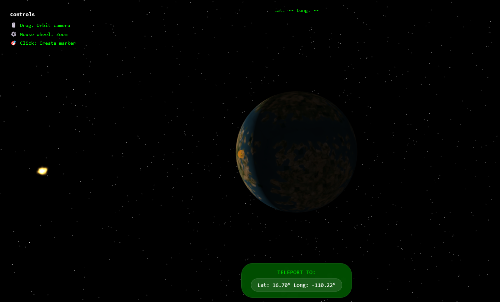

# Preface World Navigator



This was fun experiment that was built during a Hackathon at [PLAYERUNKNOWN Productions](https://playerunknownproductions.net/).

Explore the immense size of [Preface](https://store.steampowered.com/app/2820060/Preface_Undiscovered_World/) with this interactive world viewer. You can teleport to any location in the world and see the coordinates of your current position.

Clicking on the planet will generate a deep link that you can share with others to take them to that exact location!

[Online DEMO](https://playerunknown-productions.github.io/preface-globe-navigator/)

## Features

- Interactive 3D globe navigation
- Real-time coordinate display
- Shareable deep links for specific locations
- Smooth camera transitions

## PRs are welcome!

Feel free to submit a Pull Request (PR) if you have any ideas or improvements.

Let your imagination run wild. Here are some ideas:

- Add markers for clicked locations
- Create custom tours of the Preface world (with deep links)
- Add pins for notable landmarks
- Implement a search functionality
- Add distance measurements between points
- Mobile-friendly interface

## Development

Built with Three.js, WebGL, and vanilla JavaScript. Uses a 6-sided cube texture for the sphere and Vite for bundling. Features some handy coordinate calculations functions that you might find useful :wink:

### Requirements
- Node.js + npm - install from https://nodejs.org/en

### Getting Started

1. Install dependencies:
```bash
npm install
```

2. Run the development server:
```bash
npm run dev
```

3. Build for production:
```bash
npm run build
```

The static files will be generated in the `dist` folder and can be deployed to any static file server.

## License

The code in this repository is licensed under the MIT license (see [LICENSE](LICENSE)).
